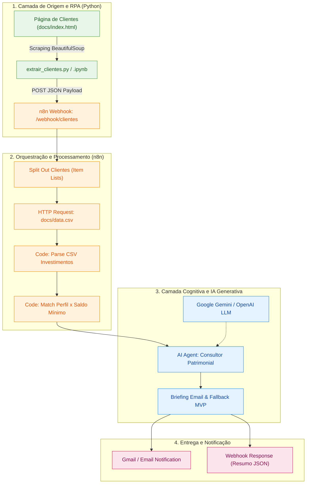

# 📐 BLUEPRINT.md - Arquitetura do Assistente de Investimentos RPA + n8n + IA

## 1. Visão Geral da Arquitetura
O sistema implementa uma esteira integrada de Robotic Process Automation (RPA) combinada com orquestração de workflows no n8n e Inteligência Artificial Generativa (LLM). O objetivo é automatizar a captura de investidores a partir de uma interface legada/web, cruzar seu perfil financeiro com opções de investimento em tempo real e produzir briefings hiperpersonalizados.



---

## 2. Estrutura de Diretórios
```text
Criando um Processo de RPA com N8N e Python/
├── BLUEPRINT.md                 # Arquitetura, fluxo de dados e topologia de nós
├── PRD.md                       # Requisitos de produto, personas e regras de negócio
├── AGENTS.md                    # Contexto para IAs e convenções de manutenção
├── README.md                    # Apresentação do projeto e instruções de execução
├── PROGRESS.md                  # Diário de bordo e status de entrega
├── docs/
│   ├── index.html               # Página web com a tabela de clientes simulados
│   └── data.csv                 # Tabela de produtos de investimento por perfil
├── rpa/
│   ├── extrair_clientes.py      # Script autônomo de RPA (linha de comando)
│   └── extrair_clientes.ipynb   # Notebook interativo (Google Colab / Jupyter)
└── n8n/
    └── workflow.json            # Workflow exportado pronto para Ctrl+V no n8n
```

---

## 3. Fluxo de Dados e Especificação de Interfaces

### 3.1. Payload de Entrada (RPA -> Webhook n8n)
```json
{
  "clientes": [
    {
      "nome": "Ana Silva",
      "email": "ana@email.com",
      "saldo": "R$ 12.500,00",
      "perfil": "Conservador"
    }
  ]
}
```

### 3.2. Base de Investimentos (`data.csv`)
| Perfil | Produto | Mínimo (R$) | Rentabilidade Estimada |
|---|---|---|---|
| Conservador | Poupança | 100 | 6.2% a.a. |
| Conservador | CDB Liquidez Diária | 1000 | 12.5% a.a. |
| Conservador | Tesouro Selic | 500 | 13.0% a.a. |
| Moderado | CDB Prefixado | 1000 | 14.0% a.a. |
| Moderado | Fundo Multimercado | 5000 | 16.0% a.a. |
| Moderado | Tesouro IPCA+ | 1000 | IPCA + 6.0% a.a. |
| Arrojado | Ações ETF | 500 | Variável |
| Arrojado | Fundo de Ações | 10000 | Variável |
| Arrojado | Criptomoedas | 100 | Variável |

### 3.3. Saída Consolidada do Webhook
```json
{
  "status": "sucesso",
  "total_processado": 10,
  "clientes_atendidos": [
    {
      "nome": "Ana Silva",
      "email": "ana@email.com",
      "perfil": "Conservador",
      "saldo": "R$ 12.500,00",
      "recomendacao": "Olá, Ana! Identificamos que seu perfil é Conservador..."
    }
  ]
}
```

---

## 4. Resiliência e Fallback
- **Fallback de Origem**: Se a URL remota do GitHub Pages estiver indisponível, o script `extrair_clientes.py` utiliza automaticamente o arquivo local `docs/index.html`.
- **Fallback de IA (Modo MVP)**: Caso as credenciais da API do Gemini ou OpenAI não estejam configuradas, o nó `Briefing Email & Fallback MVP` assume o processamento com regras dinâmicas baseadas em templates, garantindo que o pipeline nunca quebre.
