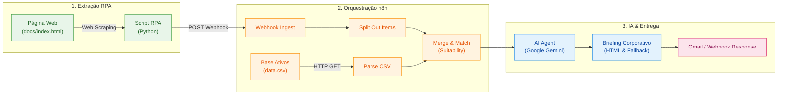

<p align="center">
  
</p>

# 🚀 Assistente de Investimentos com RPA, n8n e IA Generativa

[](https://www.dio.me)
[](https://www.python.org/)
[](https://n8n.io/)
[](https://ai.google.dev/)
[]()

Pipeline automatizado de ponta a ponta para o setor financeiro que combina técnicas de **Robotic Process Automation (RPA)** em Python, orquestração de workflows no **n8n** e **Inteligência Artificial Generativa (LLM)** para transformar a experiência de assessoria de investimentos.

---

## 📌 Sumário
- [Visão Geral](#-visão-geral)
- [Arquitetura da Solução](#-arquitetura-da-solução)
- [Estrutura do Repositório](#-estrutura-do-repositório)
- [Como Executar o Projeto](#-como-executar-o-projeto)
  - [1. Importando o Workflow no n8n](#1-importando-o-workflow-no-n8n)
  - [2. Executando o RPA em Python](#2-executando-o-rpa-em-python)
  - [3. Validação no n8n](#3-validação-no-n8n)
- [Diferenciais Implementados](#-diferenciais-implementados)
- [Créditos](#-créditos)

---

## 💡 Visão Geral

O projeto resolve o desafio de instituições financeiras de capturar perfis de investidores em páginas web ou sistemas legados e gerar recomendações de carteira em larga escala com precisão e toque humano.

### O Fluxo:
1. **Robô de RPA (Python + BeautifulSoup)**: Acessa a página de clientes, raspa dados cadastrais, saldos e perfis de investidor (`Conservador`, `Moderado`, `Arrojado`) e despacha em lote para o n8n via Webhook.
2. **Orquestrador (n8n)**:
   - Recebe a requisição e desmembra a lista de investidores.
   - Faz o download da base de ativos de investimento (`data.csv`).
   - Cruza regras de suitability: risco aceito vs. aporte mínimo requerido.
3. **Camada de Inteligência Artificial (Google Gemini / Fallback)**:
   - Analisa o momento patrimonial do cliente e redige uma mensagem executiva acolhedora, ética e fundamentada.
4. **Comunicação Multicanal**:
   - Formata um e-mail HTML corporativo e disponibiliza o retorno via API/Webhook.

---

## 📐 Arquitetura da Solução



---

## 📁 Estrutura do Repositório

```text
.
├── BLUEPRINT.md                 # Arquitetura detalhada do sistema e topologia de nós
├── PRD.md                       # Requisitos de produto, regras de negócio e personas
├── AGENTS.md                    # Contexto para agentes de IA e engenharia de prompts
├── PROGRESS.md                  # Diário de bordo e histórico de versões
├── README.md                    # Apresentação do projeto e instruções
├── docs/
│   ├── index.html               # Página web simulada com tabela de investidores
│   └── data.csv                 # Portfólio de produtos financeiros e taxas
├── rpa/
│   ├── extrair_clientes.py      # Script autônomo de RPA (CLI com logging)
│   └── extrair_clientes.ipynb   # Notebook interativo (Google Colab / Jupyter)
└── n8n/
    └── workflow.json            # Workflow completo e exportado do n8n (Ctrl+V)
```

---

## 🛠️ Como Executar o Projeto

### 1. Importando o Workflow no n8n

1. Abra sua instância do **n8n** (Cloud ou Local via Docker/npm).
2. Crie um novo workflow.
3. Copie o conteúdo do arquivo [`n8n/workflow.json`](n8n/workflow.json).
4. No painel em branco do n8n, pressione `Ctrl+V` (ou clique nos três pontinhos no canto superior direito -> **Import from File / Clipboard**).
5. O fluxo será carregado com todos os nós configurados!
6. Copie a URL do nó **Webhook - Ingest RPA** (ex: `http://localhost:5678/webhook-test/clientes`).

> 💡 **Nota de Resiliência:** O workflow possui nó de **Fallback Dinâmico** (`Briefing Email & Fallback MVP`). Mesmo que você não configure a chave de API do Gemini no momento do teste, o pipeline executará 100% com dados realistas!

---

### 2. Executando o RPA em Python

#### Opção A: Via Terminal / Script Local
```bash
# 1. Instale as dependências
pip install requests beautifulsoup4

# 2. Execute o robô informando a URL do seu Webhook n8n
python rpa/extrair_clientes.py "http://localhost:5678/webhook-test/clientes"
```

#### Opção B: Via Google Colab / Jupyter Notebook
1. Abra o arquivo [`rpa/extrair_clientes.ipynb`](rpa/extrair_clientes.ipynb) no Google Colab.
2. Atualize a variável `N8N_WEBHOOK_URL` com seu link do n8n.
3. Clique em **Executar Todas** (`Ctrl+F9`).

---

### 3. Validação no n8n

Ao executar o script Python, o n8n receberá os 10 clientes da base:
- **Ana Silva** (Conservador | R$ 12.500,00) -> Tesouro Selic, CDB Liquidez Diária
- **Bruno Lima** (Moderado | R$ 3.200,00) -> CDB Prefixado, Tesouro IPCA+
- **Carla Souza** (Arrojado | R$ 28.900,00) -> Ações ETF, Fundo de Ações, Cripto
- *(demais investidores da base...)*

O Webhook responderá com a confirmação de processamento e cada cliente terá seu briefing formatado e pronto para envio por e-mail.

---

## 🌟 Diferenciais Implementados

- **Robusto a Falhas (Fallback Offline)**: O script Python possui mecanismo automático para consultar o arquivo local caso a conexão externa falhe.
- **Suitability Dinâmico**: O nó de cruzamento no n8n valida tanto o perfil de risco quanto a capacidade de aporte financeiro do investidor.
- **Documentação de Nível Corporativo**: O repositório segue os padrões de engenharia de software com `BLUEPRINT.md`, `PRD.md` e `AGENTS.md`.

---

## 👨‍💻 Créditos

- **Desenvolvedor:** [webappdesigner.com.br](https://webappdesigner.com.br)
- **LinkedIn:** [https://www.linkedin.com/company/webapp-designer](https://www.linkedin.com/company/webapp-designer)
